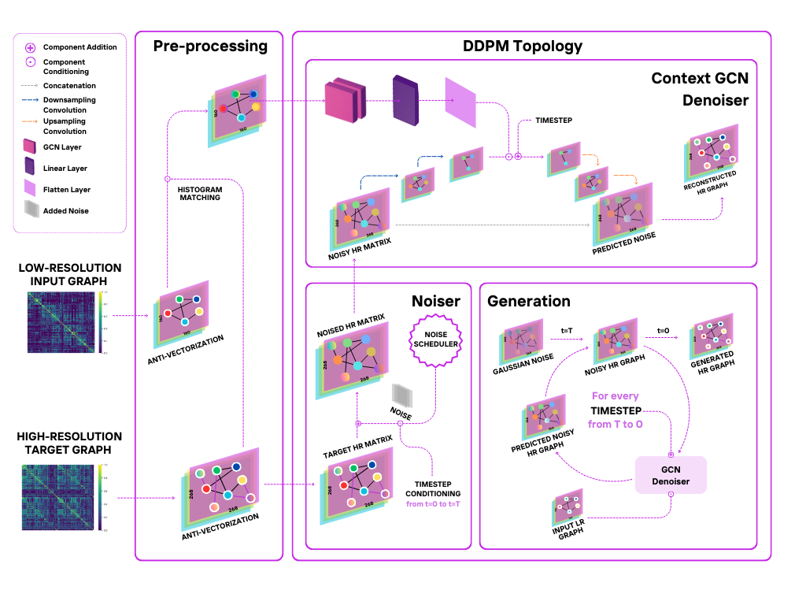
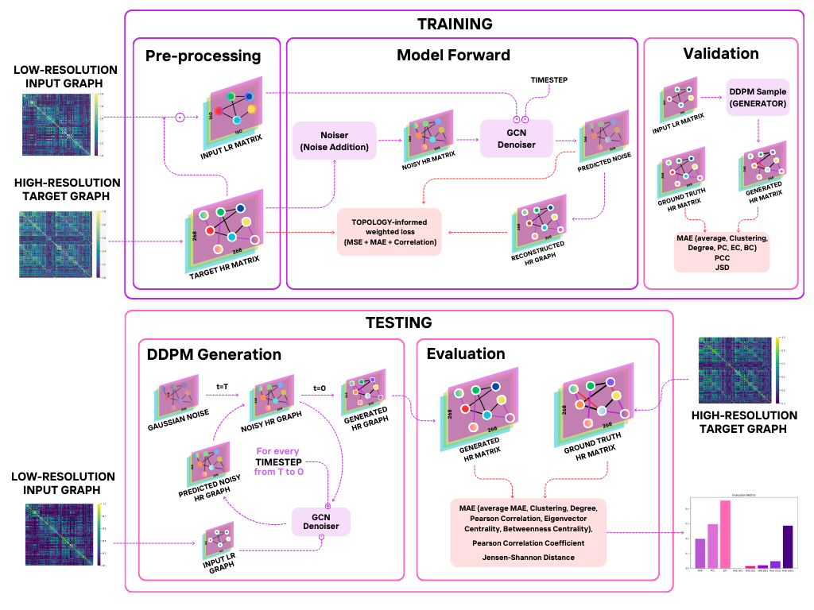
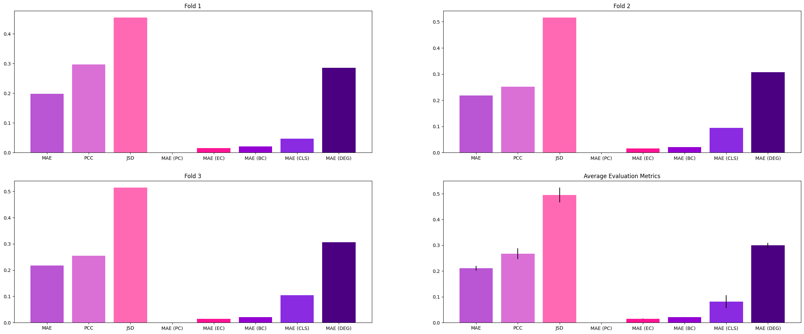

# DGL2025 Brain Graph Super-Resolution Challenge

## Contributors

Team: **Super**

- Asia Belfiore, 02129867, ab6124
- Ginevra Cepparulo, 06028727, gc1424
- Humaid Ibrahim, 06002972, hai24
- Aslihan Gulseren, 06008251, ag724

## Problem Description

**Graph super-resolution** is a problem that involves reconstructing a high-resolution (HR) graph from a low-resolution (LR) one using *Graph Neural Networks* (GNNs). In the *Brain Graph Super-Resolution Challenge*, the goal is to predict fine-grained neural connectivity maps from coarser ones. Graph super-resolution for Brain Graphs offers significant advantages compared to traditional methodologies, including significant cost and time reductions thanks to the bypassing of costly high-resolution fMRI scans. High Resolution graphs are also computationally expensive to process and super-resolution allows more efficient analysis by first handling LR graphs [[1]](#1). Furthermore, higher-resolution connectivity graphs provide better insights into neurological disorders and brain function, and can also help identify patterns in brain connectivity, potentially giving insights into disorders like Alzheimer’s [[2]](#2). 

## Name of your model - Methodology

We present **Graph-Dif-GSR**, a Diffusion-based generative GCN model based on the State-Of-The-Art [*Dif-GSR*](https://github.com/basiralab/Dif-GSR) model [[3]](#3) . It builds upon a Denoising Diffusion Probabilistic Model (DDPM) which learns how to generate HR graphs by gradually adding noise to the target HR Graphs and learning how to remove noise conditionally based on the corresponding LR graph. By accurately learning how to reverse the noising process, the DDPM is able to learn how to generate realistic HR graphs from LR ones.

We implemented custom a histogram patching mechanism to align the statistical distribution of LR and HR graphs on a patch level, which enhances the model's ability to generate HR graphs that preserve the underlying topology of the graph. 
We incorporate a novel GCN-based context embedder for the U-Net based denoiser, which incorporates the global node representations of the LR graph, providing the model with an informative signal that is fused with the time embeddings. 

In addition, we proposed a novel weighted loss function that incorporates an L1 reconstruction loss and a differentiable Pearson correlation loss to ensure that the generated graph closely matches the ground truth structurally. These complemented the MSE loss of diffusion models, which minimizes the difference between the noise and output of the Conditional Denoiser.

## Used External Libraries

All used libraries are available in the [requirements](requirements.txt) file.

- [**Pytorch**](https://pytorch.org/): framework used for building the deep learning models.
- [**PyTorch Geometric**](https://pytorch-geometric.readthedocs.io/en/latest/): pytorch-based library for Graphic Neural Networks, used in applications of deep learning to structured data like graphs.
- [**NetworkX**](https://networkx.org/): package for the creation, manipulation, and study of the structure, dynamics, and functions of complex networks.
- [**sci-kit learn**](https://scikit-learn.org/stable/): package for data modeling and machine learning algorithms.

- Visualzation and Data handling: **pandas**, **numpy**, **matplotlib**, **tqdm**

## Training and Validation 

Our code supports k-fold cross validation. To run Graph-Dif-GSR run train_DifGSR.ipynb. 

What does [train_DifGSR.ipynb](train_DifGSR.ipynb) do? Loads the datasets in [data/lr_train.csv](data/lr_train.csv) and [data/hr_train.csv](data/hr_train.csv), splits into 3 folds, and initializes, trains and validates Graph-Dif-GSR for each fold. It also stores:
- for each fold k the model predictions under [results/DDPM_Topology/predictions_fold_{k}.csv](results/DDPM_Topology/predictions_fold_1.csv)
- the evaluation metrics for each fold in [results/DDPM_Topology/metrics.csv](results/DDPM_Topology/metrics.csv).

For comparison [train.ipynb](train.ipynb) computes the same pipeline using SOTA model Dif-GSR and [train_MLP.ipynb](train_MLP.ipynb) using a simple MLP baseline.

What does [train.ipynb](train.ipynb) do? Loads the datasets in [data/lr_train.csv](data/lr_train.csv) and [data/hr_train.csv](data/hr_train.csv), splits into 3 folds, and initializes, trains and validates model for each fold. It also stores:
- the evaluation metrics for each fold in [results/DDPM/metrics.csv](results/DDPM/metrics.csv).

What does [train_MLP.ipynb](train_MLP.ipynb) do? Loads the datasets in [data/lr_train.csv](data/lr_train.csv) and [data/hr_train.csv](data/hr_train.csv), splits into 3 folds, and initializes, trains and validates model for each fold. It also stores:
- the evaluation metrics for each fold in [results/MLP/metrics.csv](results/MLP/metrics.csv).

## Results

Our model showed strong ability to **capture** and **preserve** the underlying graph topology, by achieving very low error rates with regards to Topological measures amongst *3-Fold* training and Validation runs.

Our Graph-Dif-SGR outperformed both MLP and SOTA baseline models: it significantly improves the clustering and degree errors compared to the MLP and SOTA baselines, while marginally improving the betweenness centrality.  Additionally, the inclusion of a GCN for context embedding and conditioning on the LR graph provided substantial benefits compared to the SOTA Dif-GSR model across all evaluated metrics. 

## References

<a id="1">[1]</a>  F. Pala, I. Mhiri, and I. Rekik, “Template-based inter-modality super-resolution of brain connectivity,” in Predictive Intelligence
in Medicine, I. Rekik, E. Adeli, S. H. Park, and J. Schnabel, Eds.
Cham: Springer International Publishing, 2021, pp. 70–82.

<a id="2">[2]</a> P. Singh and I. Rekik, Strongly Topology-Preserving GNNs for
Brain Graph Super-Resolution. Springer Nature Switzerland,
Oct. 2024, p. 124–136. [Online]. Available: http://dx.doi.org/10.
1007/978-3-031-74561-4_11

<a id="3">[3]</a> N. Rajadhyaksha and I. Rekik, “Diffusion-based graph super-
resolution with application to connectomics,” in Predictive In-
telligence in Medicine, I. Rekik, E. Adeli, S. H. Park, C. Cintas,
and G. Zamzmi, Eds. Cham: Springer Nature Switzerland, 2023,
pp. 96–107.